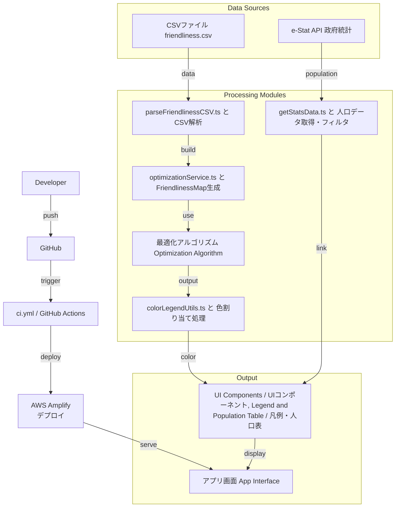

## Tokyo Friendliness App

This app optimizes prefecture groupings based on friendliness data to maximize total friendship scores using a combinatorial optimization algorithm. It fetches population data via API and assigns colors to each prefecture based on groupings.

このアプリは、友好度データに基づき都道府県のグループ分けを最適化し、総合的な友情スコアを最大化する組合せ最適化アルゴリズムを用いています。また、API経由で人口データを取得し、グループごとに都道府県へ色分けを行います。

---

## Optimization Algorithm Details

This optimization is achieved using an **advanced combinatorial optimization algorithm** that combines the following techniques:

- **Dynamic Programming with Memoization**:
  - **Stores and reuses the results of overlapping subproblems** to eliminate redundant calculations and significantly reduce overall processing time.
- **Branch-and-Bound Pruning**:
  - Immediately **eliminates (prunes) search branches** when it's determined they cannot possibly yield a better score than the current best solution, dramatically reducing the search space by cutting off inefficient paths.
- **Backtracking**:
  - Systematically explores the solution space by moving forward until a solution is found or a dead end is reached. It then **reverts to a previous decision point** to try an alternative option, ensuring all possible valid groupings are explored comprehensively.

---

## 最適化アルゴリズムの詳細

この最適化は、以下の技術を組み合わせた**高度な組合せ最適化アルゴリズム**によって実現されています。

- **動的計画法（Dynamic Programming with Memoization）**：
  - 計算過程で**重複する部分問題の解**を記憶（メモ化）し、それを再利用することで、計算の冗長性を排除し、処理時間を大幅に短縮します。
- **枝刈り（Branch-and-Bound Pruning）**：
  - 探索中のノードで、現在の最良スコアを超える結果が**絶対に得られない**と判断された場合、その先の探索を即座に打ち切ります。これにより、非効率な探索パスを剪定（せんてい）し、探索空間を劇的に削減します。
- **バックトラック（Backtracking）**：
  - 探索ツリーを順に進め、行き詰まった（または枝刈りされた）場合に、**直前の決定点**に戻り、別の選択肢を試します。これにより、すべての可能なグループ分けを体系的かつ網羅的に探索します。

---

## Quick Start

1. Clone this repository  
   このリポジトリをクローン（複製）します。
2. Run `npm install` to install dependencies  
   依存パッケージをインストールするために **`npm install`** を実行します。
3. Run `npm run dev` to start the development server  
   開発サーバーを起動するために **`npm run dev`** を実行します。

Open [http://localhost:3000](http://localhost:3000) with your browser to see the result.  
ブラウザで **[http://localhost:3000](http://localhost:3000)** を開くと、アプリの動作を確認できます。

You can start editing the page by modifying `app/page.tsx`. The page auto-updates as you edit the file.  
**`app/page.tsx`** を編集することで、ページの内容をすぐに変更し始められます。ファイルを保存すると、ページは自動的に更新されます。

This project uses `next/font` to automatically optimize and load Geist, a new font family for Vercel.  
このプロジェクトでは、Vercelの新しいフォントファミリー「Geist」を自動的に最適化し読み込むために **`next/font`** を利用しています。

You do not need to run `npm run build` for local development.  
ローカル開発においては、**`npm run build`** を実行する必要はありません。

## Deployment

This app is deployed online via AWS Amplify:  
このアプリは AWS Amplify を利用してオンラインで公開されています。

**[https://chore-enable-ssr-compute.d20y2f4xdero1h.amplifyapp.com/](https://chore-enable-ssr-compute.d20y2f4xdero1h.amplifyapp.com/)**

- Automatic builds from the SSR compute branch  
  SSR computeブランチからの自動ビルド
- SSR and static content supported  
  SSR（サーバーサイドレンダリング）と静的コンテンツの両方に対応
- Environment variables securely managed  
  環境変数を安全に管理

## Architecture Flowchart

## Tech Stack

  
  
  
  
  
  
  
  
  
  
  

