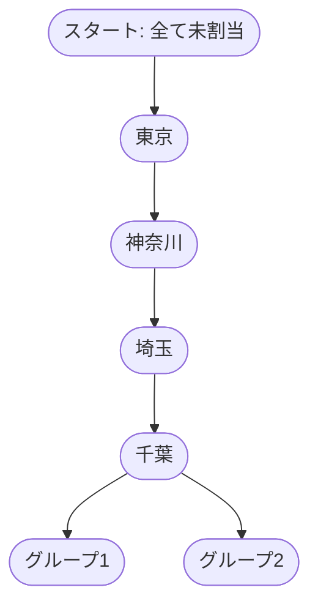

# Tokyo Friendliness Optimization Algorithm

This document provides a detailed explanation and walkthrough of the core optimization algorithm used in the Tokyo Friendliness App.

## Overview

The algorithm finds the optimal partitioning of prefectures into groups to maximize a "friendliness score." It uses:

- **Dynamic Programming**: Breaks the problem into smaller, overlapping subproblems.
- **Memoization**: Caches subproblem results to avoid redundant calculations.
- **Branch-and-Bound Pruning**: Discards branches that cannot lead to a better solution.
- **Backtracking**: Systematically explores all possible solutions.

## How the Algorithm Works

### Step-by-Step Walkthrough

1. **Memoization Check**: Checks if the current subproblem has already been solved.
2. **Base Case**: If there are no more prefectures to assign, returns the current partition and score.
3. **Pruning**: Calculates the maximum possible score from the current state. If this is less than the best score found so far, prunes the branch.
4. **Recursive Exploration**: Recursively explores all possible moves for the next prefecture:
   - Add it to each existing group.
   - Create a new group with it.
5. **Backtracking**: After exploring a move, backtracks to the previous state to explore other moves.
6. **Caching**: Caches the result of the current subproblem before returning.

## Detailed Example

Suppose we have 4 prefectures: **Tokyo, Kanagawa, Saitama, Chiba**. The friendliness scores between them are:

|          | Tokyo | Kanagawa | Saitama | Chiba |
| -------- | ----- | -------- | ------- | ----- |
| Tokyo    | -     | 10       | 5       | 2     |
| Kanagawa | 10    | -        | -3      | 1     |
| Saitama  | 5     | -3       | -       | 4     |
| Chiba    | 2     | 1        | 4       | -     |

Goal: Partition into 2 groups to maximize the sum of all within-group friendliness scores.

### Decision Tree Visualization

_At each step, the algorithm tries all possible assignments, calculates the incremental score, and prunes branches that can't beat the best found so far._

### Example Path

- Assign Tokyo and Kanagawa to Group 1: Score = 10
- Assign Saitama to Group 1: Score += 5 (Tokyo-Saitama) + (-3) (Kanagawa-Saitama) = 2, Total = 12
- Assign Chiba to Group 2: No within-group score yet for Group 2
- Final partition: [Tokyo, Kanagawa, Saitama], [Chiba], Total Score = 12

The algorithm explores all such paths, memoizes results, and returns the best partition.

---

## Time and Space Complexity

- **Time Complexity:** $O(Bell(n) \cdot n^2)$, where $Bell(n)$ is the Bell number (number of partitions of $n$ items). This is much better than brute-force for moderate $n$ due to pruning and memoization.
- **Space Complexity:** $O(Bell(n) \cdot n)$ for the memoization cache.

---

## Key Insights

- The algorithm is a tree search where each node represents a partial partition.
- It explores all paths but prunes impossible ones.
- The best solution uses the best sub-solutions (optimal substructure).

## For More Details

See the implementation in `src/lib/algorithm/optimizeGroups.ts`.

---

## 東京フレンドリー度最適化アルゴリズム

このドキュメントは、Tokyo Friendliness App で使用されている、核となる最適化アルゴリズムの詳細な解説と手順を日本語でまとめたものです。

## 概要

このアルゴリズムは、都道府県をグループに分割し、「フレンドリー度スコア」を最大化する最適な分け方を見つけます。そのために、以下の手法を組み合わせています。

- **動的計画法（Dynamic Programming）**: 複雑な問題を、より小さく重複する複数の副問題に分割して解きます。
- **メモ化（Memoization）**: 一度計算した副問題の結果をキャッシュ（記憶）しておき、無駄な再計算を防ぎます。
- **分枝限定法による枝刈り（Branch-and-Bound Pruning）**: これ以上探索しても最良の解に到達する可能性のない探索ルートを切り捨てます。
- **バックトラッキング（Backtracking）**: 全ての可能性のある解を漏れなく、かつ体系的に探索します。

## アルゴリズムの流れ

### ステップごとの説明

- **メモ化チェック**: 現在取り組んでいる副問題が、過去に既に解決されているかどうかを確認します。
- **終了条件（ベースケース）**: 割り当てる都道府県が全てなくなったら、その時点のグループ分けの結果とスコアを返して処理を終えます。
- **枝刈り**: 現在の状態から計算できる最大スコアを予測します。この最大スコアが、これまでに発見された最良スコアよりも低い場合、その探索ルートは切り捨て（枝刈り）られます。
- **再帰的探索**: 次の都道府県に対して可能な全ての割り当て方法を再帰的に試します。
  - 既存の全てのグループに追加する。
  - その都道府県だけで新しいグループを作成する。
- **バックトラッキング**: ある割り当て方法の探索を終えた後、直前の状態に戻り（後戻り）、別の割り当て方法の探索に移ります。
- **結果のキャッシュ**: 現在の副問題の結果をキャッシュに保存した上で返却します。

## 詳細な例

例えば、東京、神奈川、埼玉、千葉の4つの都道府県があり、それらの間のフレンドリー度スコアが以下の表のようになっているとします。

|        | 東京 | 神奈川 | 埼玉 | 千葉 |
| ------ | ---- | ------ | ---- | ---- |
| 東京   | -    | 10     | 5    | 2    |
| 神奈川 | 10   | -      | -3   | 1    |
| 埼玉   | 5    | -3     | -    | 4    |
| 千葉   | 2    | 1      | 4    | -    |

目標：グループ内のフレンドリー度スコアの合計が最大になるように、2つのグループに分割する。

### 決定木イメージ

このアルゴリズムは、各ステップで可能な全ての割り当てを試し、増分スコアを計算し、最良スコアを上回る可能性のないルートは枝刈りします。

### 探索の具体例

- 東京と神奈川をグループ1に割り当てる: スコア = 10
- 埼玉をグループ1に割り当てる: スコアに +5（東京-埼玉）と +(-3)（神奈川-埼玉）が加算され、合計の増分は +2。合計スコア = 12
- 千葉をグループ2に割り当てる: グループ2はまだ千葉のみなので、グループ内のスコアは0
- 最終的なグループ分け: [東京, 神奈川, 埼玉], [千葉]、合計スコア = 12

アルゴリズムはこのような全ての経路を探索し、結果をメモ化しつつ、最も良いグループ分けを返します。

## 計算量

- **時間計算量（Time Complexity）:** $O(Bell(n) \cdot n^2)$ で表されます。ここで Bell(n) はベル数（n個のアイテムの分割の総数）です。枝刈りやメモ化のおかげで、総当たりよりもはるかに効率的です。
- **空間計算量（Space Complexity）:** メモ化のためのキャッシュに $O(Bell(n) \cdot n)$ が必要です。

## 重要なポイント

- このアルゴリズムは、各ノードが部分的なグループ分けを表す「ツリー探索」です。
- 全ての経路を探索しますが、最良解になり得ない経路は積極的に切り捨てます。
- 最良の解は、最適な部分的な解を組み合わせて導かれます（最適部分構造）。

## 詳細実装

具体的な実装は `src/lib/algorithm/optimizeGroups.ts` をご参照ください。
