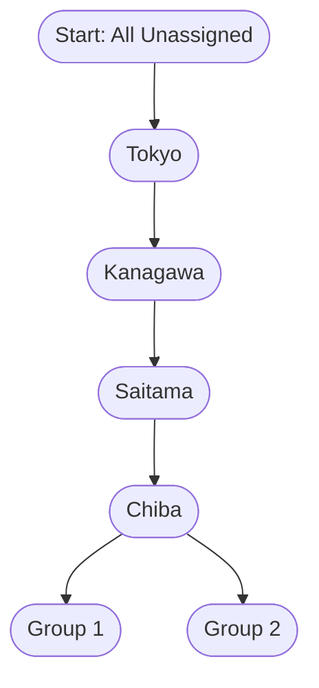

# Tokyo Friendliness Optimization Algorithm

This document provides a detailed explanation and walkthrough of the core optimization algorithm used in the Tokyo Friendliness App.

## Overview

The algorithm finds the optimal partitioning of prefectures into groups to maximize a "friendliness score." It uses:

- **Dynamic Programming**: Breaks the problem into smaller, overlapping subproblems.
- **Memoization**: Caches subproblem results to avoid redundant calculations.
- **Branch-and-Bound Pruning**: Discards branches that cannot lead to a better solution.
- **Backtracking**: Systematically explores all possible solutions.

## How the Algorithm Works

### Step-by-Step Walkthrough

1. **Memoization Check**: Checks if the current subproblem has already been solved.
2. **Base Case**: If there are no more prefectures to assign, returns the current partition and score.
3. **Pruning**: Calculates the maximum possible score from the current state. If this is less than the best score found so far, prunes the branch.
4. **Recursive Exploration**: Recursively explores all possible moves for the next prefecture:
   - Add it to each existing group.
   - Create a new group with it.
5. **Backtracking**: After exploring a move, backtracks to the previous state to explore other moves.
6. **Caching**: Caches the result of the current subproblem before returning.

## Detailed Example

Suppose we have 4 prefectures: **Tokyo, Kanagawa, Saitama, Chiba**. The friendliness scores between them are:

|          | Tokyo | Kanagawa | Saitama | Chiba |
| -------- | ----- | -------- | ------- | ----- |
| Tokyo    | -     | 10       | 5       | 2     |
| Kanagawa | 10    | -        | -3      | 1     |
| Saitama  | 5     | -3       | -       | 4     |
| Chiba    | 2     | 1        | 4       | -     |

Goal: Partition into 2 groups to maximize the sum of all within-group friendliness scores.

### Decision Tree Visualization

_At each step, the algorithm tries all possible assignments, calculates the incremental score, and prunes branches that can't beat the best found so far._

### Example Path

- Assign Tokyo and Kanagawa to Group 1: Score = 10
- Assign Saitama to Group 1: Score += 5 (Tokyo-Saitama) + (-3) (Kanagawa-Saitama) = 2, Total = 12
- Assign Chiba to Group 2: No within-group score yet for Group 2
- Final partition: [Tokyo, Kanagawa, Saitama], [Chiba], Total Score = 12

The algorithm explores all such paths, memoizes results, and returns the best partition.

---

## Time and Space Complexity

- **Time Complexity:** $O(Bell(n) \cdot n^2)$, where $Bell(n)$ is the Bell number (number of partitions of $n$ items). This is much better than brute-force for moderate $n$ due to pruning and memoization.
- **Space Complexity:** $O(Bell(n) \cdot n)$ for the memoization cache.

---

## Key Insights

- The algorithm is a tree search where each node represents a partial partition.
- It explores all paths but prunes impossible ones.
- The best solution uses the best sub-solutions (optimal substructure).

## For More Details

See the implementation in `src/lib/algorithm/optimizeGroups.ts`.
